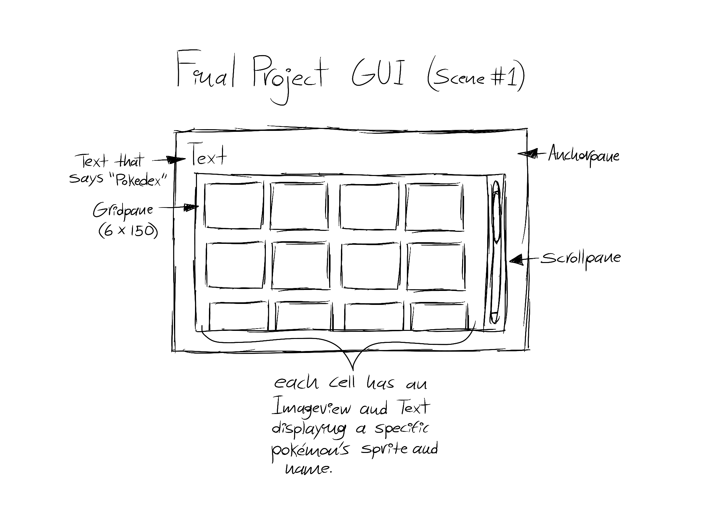

# Final Project GUI
## Final Project Description
_This is a project that aims to work like a Pokedex from the Pokemon games, it gives you a list of 151 Pokemon to checkout their information that include all kinds of stuff that being their name, types, height and widght, abilities, stats, and an entry that tells you a fact about that Pokemon, it also let's you check their shiny, gender, and mega forms all of this while displaing it in a way similar to the games._

## GUI Wireframe

.png)
